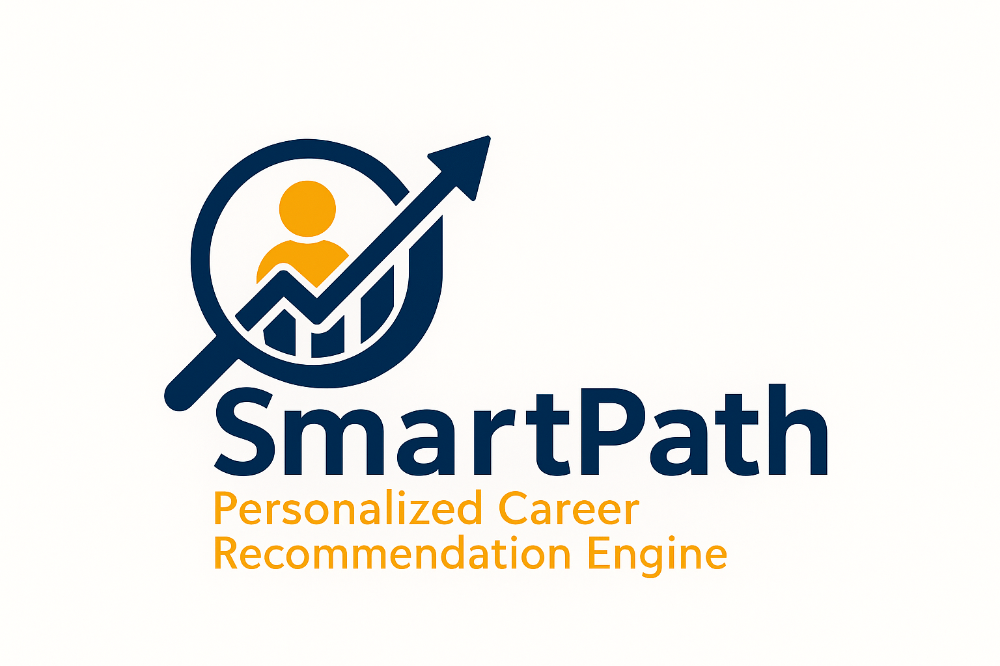

# Capstone Project- SmartPath Career Recommender Engine
Empowering informed career decisions through intelligent, data-driven recommendations.

  

Discover careers aligned with your strengths, passions, and education.  
*Powered by RIASEC Science and real-world job market data.*

## Overview
SmartPath is a personalized career recommendation system that helps students, graduates, and job seekers, especially from underserved communities to discover careers aligned with their interests, skills, and education level, powered by the O*NET occupational database.

Unlike generic career portals, SmartPath uses a hybrid similarity model plus machine learning insights to deliver custom career recommendations with actionable steps. helping users identify their best-fit occupations and the skills they need to thrive.

---

## Core Features

Collects user input for:
- RIASEC interest scores (Realistic, Investigative, Artistic, Social, Enterprising, Conventional)
- Educational attainment
- Self-identified strong skills

Computes:
- Cosine similarity between user interests and occupational profiles
- Skill match scores based on selected user strengths
- Education gap analysis

Outputs:
- Top career matches with hybrid similarity scores
- Matched skills and gaps
- CSV export + optional email delivery
- Summary visualization of top 3 job recommendations

---

## Data Sources
SmartPath leverages curated occupational data from reliable public resources to ensure accuracy and relevance in career recommendations.  

| Dataset                    | Description                                                     | Source                                                                           |
| -------------------------- | --------------------------------------------------------------- | -------------------------------------------------------------------------------- |
| **O\*NET 27.0 Database**   | Occupational profiles with skills, RIASEC scores, and education | [O\*NET Database](https://www.onetcenter.org/database.html)                      |
| **Interests Data**         | RIASEC distributions per job                                    | [O\*NET Interests](https://www.onetonline.org/find/descriptor/result/4.A.1.a.1)  |
| **Skills Importance**      | Importance ratings for 35+ skills per job                       | [O\*NET Skills](https://www.onetonline.org/skills/)                              |
| **Education Requirements** | Mapped typical education levels per occupation                  | [O\*NET Education](https://www.onetonline.org/find/descriptor/browse/Education/) |
|

The datasets were cleaned, transformed, and combined into a unified job profile format (job_profiles_clean.csv) used for real-time matching.

Cleaned Dataset Sample (hosted for testing/demo):./data/job_profiles_clean.csv

---

## Tech Stack

- **Python 3.10+**
- **Pandas**, **NumPy**, **Scikit-learn**, **XGBoost**
- 
- **Matplotlib / Seaborn** for visualizations
- **Jupyter Notebook** (Interactive prototyping)
- **Streamlit** for future UI
- **Email Integration**: via `smtplib` and `EmailMessage`

---
## Models & Recommendation Engine Logic
The core of SmartPath is a **hybrid similarity model** that blends statistical scoring and machine learning to ensure highly personalized career recommendations.

- **Cosine Similarity**  
  Measures the angle between the user's RIASEC vector and each occupation's interest vector from O\*NET. Returns values from -1 (opposite) to 1 (perfect match).

- **Filtered Hybrid Similarity Score**  
  A final weighted score combining:  
  - RIASEC Cosine Similarity  
  - Skill Match Ratio (overlap of top 3 user skills vs. job-required skills)  
  - Education Level Compatibility (0 = mismatch, 1 = partial match, 2 = full match)

> These scores form the ranking backbone of our Top 10 career suggestions.

---

### Unsupervised Learning (Career Group Discovery)

Unsupervised learning was applied to find patterns and cluster jobs in the feature space. This supports **recommendation diversification** and enhances insight explainability.

- **KMeans Clustering** - Primary clustering algorithm for grouping jobs based on combined skill and interest profiles  
- **Agglomerative Clustering** - Built job similarity dendrograms for hierarchy understanding  
- **DBSCAN** - Identified niche job segments and outliers  
- **HDBSCAN** - Dynamic, noise-aware clustering for highly granular career paths

---

### Supervised Learning (Classification & Prediction)

Supervised ML was used to predict likely job clusters or roles based on labeled user profiles, improving the model's ability to validate and reinforce recommendations.

- **Logistic Regression** - Fast probabilistic classifier for early testing  
- **Random Forest** - Robust tree-based model for job path prediction  
- **XGBoost** - High-performing, interpretable model trained on cleaned and engineered user-job interaction data

---

## How It Works

1. **User Input**  
   The user provides RIASEC scores, top 3 skills (optional), and their highest education level via a simple interface.
    - Inputs: RIASEC (6-dim), skills (3), education level

2. **Profile Matching and Prediction Engine**  
   The system compares the user profile to thousands of job profiles from O\*NET using cosine similarity and skill/education matching.
    - Cosine Similarity: RIASEC vs. job interest vectors
    - Skill Match: Intersection of user vs. role-required skills
    - Education Match: Based on level mapping

3. **Recommendation Generation**  
   Jobs are scored and ranked based on:
   - RIASEC similarity (40%)
   - Skill match (30%)
   - Education alignment (30%)

4. **Output Delivery**  
   The top 10 jobs are displayed and saved in a CSV file. Users can also opt to receive the file via email.
    - Top 10 career suggestions
    - CSV export + optional emailing
    - kill gap insights

---

## Additions
**1. User Feedback System**

Collects session-based, timestamped feedback via emoji rating or text (stored in feedback.csv)
  - Optional chart dashboard of average feedback (Streamlit bar charts)
  - Admin alert capability (Slack API or email)

**2 Dashboard for Admin Insights**
Visualizes user input trends, top recommended careers, and feedback distribution using interactive charts

---
## Future Improvements
- Streamlit-based full UI with session login
- Resume parsing for automated user input
- Career progression pathway prediction
- Geo-personalized recommendations based on local demand
- NLP on job descriptions for deeper similarity scoring

---

## Acknowledgments
We would like to express our sincere gratitude to:

- Moringa School – for providing the learning foundation and project framework.
- O*NET (Occupational Information Network) – for the rich job dataset that powers this recommendation engine.
- Career Development Theorists – especially John Holland, for the RIASEC model.
- Our Moringa School instructors:
   - Mildred Jepkosgei 
   - Brian Chacha
   - Antony Muiko
for  the mentorship and support in fostering innovative talent.
This work reflects a growing commitment to applying data science in empowering youth, career clarity, and digital transformation in Africa.

---

## Authors

**Rachael Nyawira**  
Kenya | Data Science Learner | Passionate about using data to transform lives  
Email:
[GitHub](https://github.com/yourgithubusername) | [LinkedIn](https://www.linkedin.com/in/yourlinkedin/)

**Beryl Okelo**  
Kenya | Data Science Learner | Passionate about using data to transform lives  
Email: 
[GitHub](https://github.com/yourgithubusername) | [LinkedIn](https://www.linkedin.com/in/yourlinkedin/)

**Beth Nyambura**  
Kenya | Data Science Learner | Passionate about using data to transform lives  
Email:  
[GitHub](https://github.com/yourgithubusername) | [LinkedIn](https://www.linkedin.com/in/yourlinkedin/)

**Allan Ofula**  
Kenya | Data Science Associate | Youth Advocate | Developer of SmartPath | Passionate about using data to transform lives  
[Email:] ofulaallan@gmail.com  
[GitHub](https://github.com/Allan-Ofula) | [LinkedIn](https://www.linkedin.com/in/allan-ofula-b2804911b/)

**Eugene Maina**  
Kenya | Data Science Learner | Passionate about using data to transform lives  
Email: 
[GitHub](https://github.com/yourgithubusername) | [LinkedIn](https://www.linkedin.com/in/yourlinkedin/)

---

## Final Note
SmartPath is more than a tool - it's a movement to democratize personalized, intelligent career guidance using the power of AI and open data, one youth at a time.

